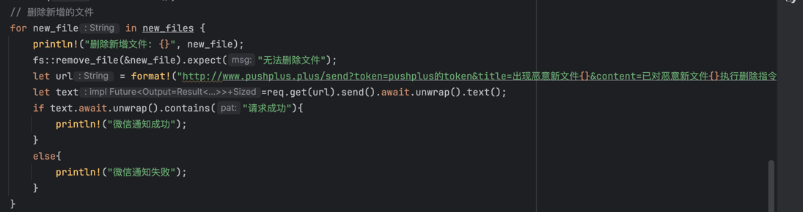
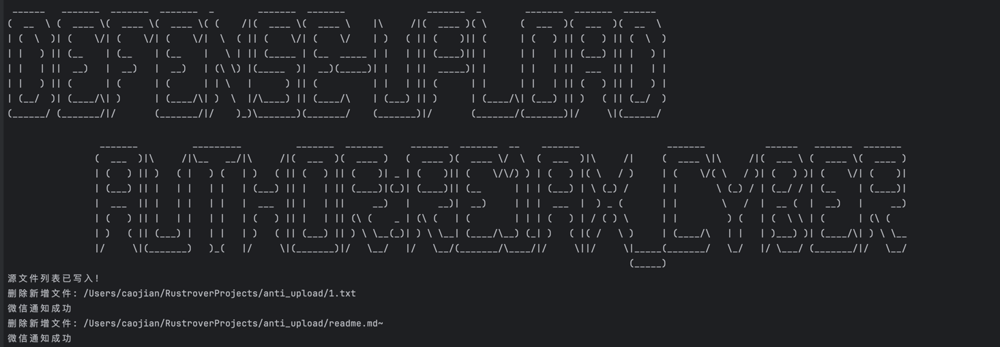

本工具主要是针对各类HVV及AWD情况下对机器的篡改告警及自动删除新建文件,并支持实时推送结果到微信,如不需要可注释掉相关代码.
## 1. 配置
在main.rs中将pushplus的token替换即可.

## 2.运行
1. cargo run (针对服务器有rust环境,或测试使用,如服务器无rust环境,可执行编译后文件)
2. cargo build --release (执行编译,编译后路径位于./target/指定的架构/release中)
3. 上传到服务器正常执行.
## 3.主界面

